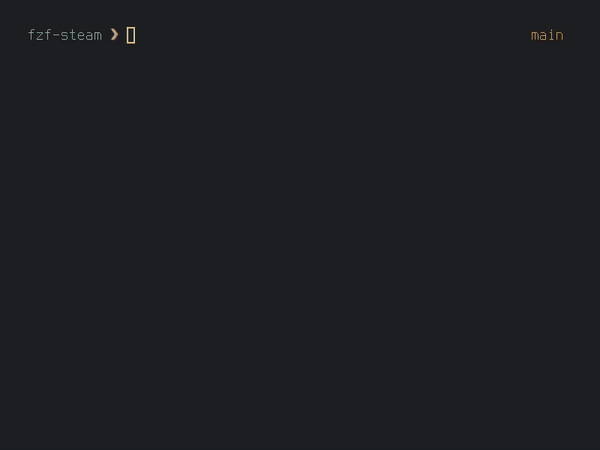

# fzf-steam
A shell script to launch installed steam games.
Thank you ntcarlson for the initial script and inspiration - https://github.com/ntcarlson/dotfiles/blob/delta/config/rofi/scripts

Dependecies - fzf [https://github.com/oscarmohr/lnch](lnch)

## Demo

 
